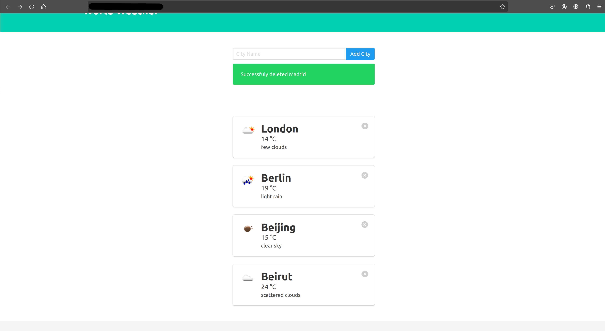

## Weather Tracker (Azure Compute Solution)
This is a Flask-based Weather App hosted on Azure Cloud using OpenWeatherMap API
_For those from London, an alert will be triggered when when the weather reaches a significant stage i.e. very cold, very hot, rain or snow.

### Tehcnologies
- Python (Flask, SQLAlcehmy, Requests)
- SQLite
- OpenWeatherMap API
- HTML & Bulma
- Docker
- Azure: CLI, Container Registry, Container Instances, Functions, App Service (Web app), Insights and Monitor


### Infrastructure
- Azure App Service Web App (Hosting the web application)
- Azure Container Registry (Storing Docker images for the app)
- Azure Container Instance (Running the containers for development/testing)
- Azure Functions (Weather alert system)
- Azure Container Apps (Running the containers in production)

### Diagram

```
 
|->  Docker Images (Azure Container Registry)
   |-> Testing Containers (Azure Container Instance)
      |-> Running Containers (Azure Container Apps)
         |-> Web Application (Hosted on Azure App Service Web App)
            |->  Weather Alerts (Azure Functions)
```


### Hosted Locally
<div align=center margin= auto> 
  
</div>

### Container Instances (Test Env)
<div align=center margin= auto> 
  
</div>

### Azure App Service: Web App (Prod)
<div align=center margin= auto> 
  
</div>


### Implementation Guide

Implementation Guide

   1) Develop a basic web application that uses weather APIs. (HTML, Python, Flask, Requests, SQLAlchemy or can use language of choice)  
   2) Containerize the application. (Docker)
   3) Publish the container image to Azure Container Registry. (Azure CLI and AZ Container Registry)
   4) Test the application using Azure Container Instance by pulling image from ACR. (AZ Container Instance)
   5) Implement an Azure Function to send alerts when a specified weather threshold is met. (AZ Functions App and Python)
   6) Integrate Azure Function with your web application. (AZ Functions)
   7) Create an Azure App Service Web App and pull image from ACR. (Azure App Service)
   8) Setup Application insights and Azure monitor

